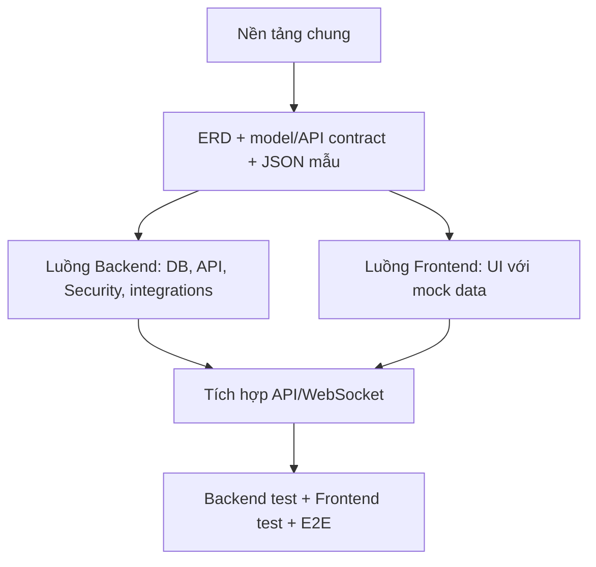

# UTEGear — Kế hoạch phát triển và Git workflow cho nhóm 2 thành viên

> Repository: `https://github.com/NgocYuh/UTEGear`
> Mục tiêu: xây dựng lại dự án theo từng chức năng có kiểm thử, mỗi task có branch và Pull Request riêng; không đưa toàn bộ mã nguồn cũ vào một lần.

## 1. Nguyên tắc thực hiện

Repository cũ chỉ được dùng làm tài liệu tham khảo và bản sao lưu. Khi thực hiện một task, chỉ chuyển hoặc viết lại đúng phần mã nguồn thuộc task đó, kiểm tra lại thiết kế, chạy test rồi mới commit.

Không thực hiện các hành vi sau:

- Sao chép toàn bộ dự án cũ vào repository mới trong một commit.
- Tạo commit giả, đổi ngày commit hoặc ghi nhận một task chưa thực hiện.
- Commit code chưa build được chỉ để tạo lịch sử Git.
- Đưa mật khẩu Supabase, JWT secret hoặc Cloudinary secret lên GitHub.
- Sửa trực tiếp database chung mà không có Flyway migration tương ứng.
- Tiếp tục code task mới trên branch của task đã merge.

Quy ước chính:

- Một task = một branch ngắn hạn = một Pull Request.
- `main` luôn phải build và test thành công.
- Sau khi merge, xóa branch trên GitHub và máy cá nhân.
- Chỉ bắt đầu task khi các task phụ thuộc đã được merge vào `main`.
- Task nhỏ có thể hoàn thành trong một buổi; không gom nhiều chức năng lớn vào cùng một PR.

## 2. Kiến trúc đã chốt

| Thành phần | Quyết định |
|---|---|
| Backend | Java 21, Spring Boot 3.3.x |
| View | Thymeleaf, Bootstrap, CSS/JavaScript |
| Persistence | Spring Data JPA |
| Database | PostgreSQL trên Supabase |
| Quản lý schema | Flyway |
| Xác thực | JWT cho các API cần bảo vệ |
| Media | Cloudinary; database lưu `secureUrl` và `publicId` |
| Realtime | WebSocket/STOMP cho thông báo đơn hàng |
| Crawler | Chỉ chạy đến khi dữ liệu sản phẩm đủ dùng |
| Tồn kho | Theo `cửa hàng + biến thể sản phẩm` |
| CI | GitHub Actions chạy Maven build và test |

Quyết định nghiệp vụ đã chốt:

- Mọi sản phẩm có ít nhất một biến thể.
- Sản phẩm không có lựa chọn màu, switch hoặc layout có đúng một biến thể mặc định.
- Tồn kho dùng cặp `Store + ProductVariant`; không tạo tồn kho trực tiếp theo `Product`.
- Cặp `store_id + variant_id` là duy nhất.
- Cart, checkout và order luôn tham chiếu biến thể, kể cả biến thể mặc định.

## 3. Phân công chính thức

### Backend — `@NgocYuh`

- PostgreSQL/Supabase, ERD, Flyway và dữ liệu tham chiếu.
- Entity, repository, service, controller, DTO và toàn bộ API.
- JWT, Spring Security và phân quyền.
- Cloudinary phía server, WebSocket/STOMP phía server.
- Crawler, validator, importer và backend test.
- Viết model contract, endpoint contract và JSON mẫu trước implementation để Frontend dùng
  làm mock data.

### Frontend — `@trongsonho`

- Thymeleaf, layouts, fragments và Bootstrap.
- CSS/JavaScript, giao diện trang khách hàng và quản trị.
- Gọi API, validation phía client và WebSocket/STOMP client.
- Responsive, accessibility, trạng thái loading/empty/error và frontend test.
- Dựng UI bằng mock data đã được Backend công bố; không tự thêm field ngoài contract.

Nếu danh tính hoặc vai trò không còn được ghi rõ trong repository, phải hỏi người dùng trước;
không tự gán ai là Backend hoặc Frontend.

Một chức năng có cả hai lớp phải được tách thành task Backend và task Frontend riêng. Không
giao một task khiến một thành viên vừa sửa Java/backend vừa xây template/CSS/JavaScript.

### File dùng chung

Trước khi sửa các file sau, người thực hiện phải báo cho thành viên còn lại:

- `pom.xml`
- `application*.properties`
- `SecurityConfig.java`
- Các file Flyway trong `db/migration/`
- `layouts/main.html`, header và footer
- Entity hoặc DTO được cả hai luồng chức năng sử dụng
- `README.md`, `UTEGear_INCREMENTAL_DEVELOPMENT_PLAN.md`, `AGENTS.md`

## 4. Workflow chuẩn cho mỗi task

### Bước 1 — Nhận task

- Đọc mô tả và điều kiện hoàn thành.
- Xác nhận task phụ thuộc đã merge.
- Xác định file dự kiến thay đổi.
- Nếu phải sửa file dùng chung, thông báo trước cho thành viên còn lại.
- Thêm Task ID vào nhật ký của vai trò và đặt trạng thái `IN PROGRESS`.

### Bước 2 — Tạo branch từ `main` mới nhất

```bash
git switch main
git pull origin main
git switch -c <ten-branch>
```

Không tạo branch mới từ branch feature cũ.

### Bước 3 — Phát triển và commit

- Chỉ làm đúng phạm vi task.
- Chạy test liên quan trước commit.
- Có thể có nhiều commit nhỏ trong branch, nhưng mỗi commit phải có ý nghĩa.

```bash
git add <cac-file-cua-task>
git commit -m "<type>: <mo-ta-ngan>"
```

Các loại commit:

- `feat`: thêm chức năng.
- `fix`: sửa lỗi.
- `test`: thêm hoặc sửa test.
- `docs`: tài liệu.
- `refactor`: tái cấu trúc không đổi nghiệp vụ.
- `chore`: cấu hình, dependency hoặc công việc nền.
- `ci`: GitHub Actions.

### Bước 4 — Đồng bộ trước khi mở PR

```bash
git fetch origin
git rebase origin/main
./mvnw clean verify
git diff --check
```

Nếu rebase phát sinh conflict, giải quyết trên branch task. Không sửa trực tiếp `main`.

### Bước 5 — Push và Pull Request

```bash
git push -u origin <ten-branch>
```

Pull Request phải ghi:

- Task ID.
- Chức năng đã làm.
- File hoặc module bị ảnh hưởng.
- Cách kiểm thử.
- Có migration hay không.
- Có biến môi trường mới hay không.
- Ảnh chụp nếu thay đổi giao diện.
- Đường dẫn nhật ký tiến độ đã cập nhật trạng thái `IN REVIEW`.

### Bước 6 — Review và merge

- Thành viên còn lại review PR.
- CI phải xanh.
- Dùng **Squash and merge** nếu branch có nhiều commit sửa lặt vặt.
- Khi phạm vi đã hoàn tất, kiểm thử pass và PR được duyệt, cập nhật nhật ký thành `DONE`, bổ sung
  PR và ngày hoàn tất trong commit cuối của cùng branch.
- Sau merge, xóa branch remote.

Nếu task không thể tiếp tục, người phụ trách phải cập nhật trạng thái `BLOCKED`, ghi rõ phần
còn thiếu và hành động cần thiết trước khi chuyển sang task khác.

```bash
git switch main
git pull origin main
git branch -d <ten-branch>
git fetch --prune
```

## 5. Definition of Done áp dụng cho mọi task

Một task chỉ được xem là hoàn thành khi:

- [ ] Chỉ thay đổi đúng phạm vi task.
- [ ] Không có secret hoặc dữ liệu cá nhân trong commit.
- [ ] Code build thành công.
- [ ] Test mới và test cũ đều pass.
- [ ] Không còn log debug, file tạm hoặc code bị comment không cần thiết.
- [ ] Nếu thay đổi schema, có Flyway migration.
- [ ] Nếu thêm biến môi trường, cập nhật file example và tài liệu setup.
- [ ] Nếu thêm API, cập nhật API contract.
- [ ] Nếu thêm hoặc đổi model/API, có JSON mẫu và Frontend đã review contract.
- [ ] Nếu thay đổi giao diện, kiểm tra desktop và mobile.
- [ ] Pull Request đã được thành viên còn lại review.
- [ ] CI pass trước khi merge.
- [ ] Nhật ký tiến độ của vai trò ghi đúng trạng thái, việc đã làm, kết quả kiểm thử, vướng mắc,
      Pull Request và ngày hoàn tất.

## 6. Thứ tự phát triển tổng quát



Sau khi contract của một module merge, Backend và Frontend triển khai song song trên hai branch
khác nhau. Frontend chỉ chờ contract, không chờ entity/service/controller hoặc endpoint thật.

## 7. Backlog chi tiết

### Giai đoạn 0 — Repository foundation

#### FND-01 — Khởi tạo scaffold

- Phụ trách: Backend (`@NgocYuh`).
- Branch: `chore/project-scaffold`.
- Phụ thuộc: không.
- Nội dung:
  - Tạo cây thư mục dự án.
  - Thêm `.gitignore`, Maven Wrapper, `pom.xml` và class khởi động tối thiểu.
  - Thêm cấu hình example, không chứa secret.
  - Thêm `README.md`, `PRODUCT.md`, `UTEGear_INCREMENTAL_DEVELOPMENT_PLAN.md` và `AGENTS.md`.
- Không làm:
  - Không thêm entity, controller hoặc giao diện nghiệp vụ.
- Kiểm tra:
  - `./mvnw clean verify`.
  - `git diff --check`.
- Commit đề xuất: `chore: initialize UTEGear project scaffold`.

#### FND-02 — Cấu hình môi trường và profile

- Phụ trách: Backend (`@NgocYuh`).
- Branch: `chore/application-profiles`.
- Phụ thuộc: FND-01.
- Nội dung:
  - Tách cấu hình `local`, `test` và `prod`.
  - Cấu hình biến môi trường Supabase, JWT và Cloudinary.
  - Bảo đảm test không kết nối Supabase thật.
  - Tạo tài liệu local development.
- Kiểm tra:
  - Context test khởi động bằng profile `test`.
  - Không có credential thật trong Git diff.
- Commit đề xuất: `chore: configure application environments`.

#### FND-03 — CI và Pull Request workflow

- Phụ trách: Backend (`@NgocYuh`), Frontend review phạm vi frontend check.
- Branch: `ci/backend-quality-gate`.
- Phụ thuộc: FND-01.
- Nội dung:
  - GitHub Actions với Java 21.
  - Maven cache.
  - Chạy `clean verify` khi mở PR vào `main`.
  - Pull Request template.
- Kiểm tra:
  - Workflow chạy xanh trên chính PR của task.
- Commit đề xuất: `ci: add backend verification workflow`.

#### FND-04 — Frontend quality workflow

- Phụ trách: Frontend (`@trongsonho`).
- Branch: `ci/frontend-quality-gate`.
- Phụ thuộc: FND-01.
- Nội dung:
  - Xác định kiểm tra phù hợp cho Thymeleaf, HTML, CSS và JavaScript khi frontend bắt đầu có code.
  - Không thêm lint giả hoặc dependency chỉ để workflow có bước chạy.
  - Giữ `workflow_dispatch` cho đến khi có công cụ kiểm tra thật, sau đó kích hoạt trên Pull Request.
- Kiểm tra:
  - Workflow không báo thành công giả khi chưa có công cụ.
- Commit đề xuất: `ci: define frontend quality workflow`.

### Giai đoạn 1 — Contract trước implementation

#### DB-01 — Chốt ERD và model contract

- Phụ trách: Backend (`@NgocYuh`) viết, Frontend (`@trongsonho`) review dữ liệu cần hiển thị.
- Branch: `docs/database-model`.
- Phụ thuộc: FND-02.
- Nội dung:
  - Danh sách bảng, khóa chính, khóa ngoại và unique constraint.
  - Quan hệ user, product, variant, store, inventory, cart, order và payment.
  - Thể hiện quan hệ một `Product` có ít nhất một `ProductVariant`.
  - Tạo biến thể mặc định cho sản phẩm không có thuộc tính lựa chọn.
  - Inventory tham chiếu `Store` và `ProductVariant`; unique theo `store_id + variant_id`.
  - Cart item và order item tham chiếu biến thể.
- Kiểm tra:
  - Cả hai thành viên approve tài liệu.
  - ERD không có bảng tồn kho chỉ tham chiếu `Product`.
- Commit đề xuất: `docs: define database model and constraints`.

#### API-01 — Contract nền, Auth và Catalog

- Phụ trách: Backend (`@NgocYuh`) viết, Frontend (`@trongsonho`) review khả năng sử dụng.
- Branch: `docs/api-contract-baseline`.
- Phụ thuộc: DB-01.
- Nội dung:
  - Liệt kê endpoint public, authenticated và admin theo từng module.
  - Ghi method, path, quyền, request, response, mã lỗi, phân trang và enum.
  - Tạo JSON mẫu cho trạng thái đầy đủ, rỗng, validation error và unauthorized/forbidden.
  - Bao phủ auth, profile, category, brand, product, search và pagination.
  - Product response luôn có `variants`; JSON mẫu bao phủ biến thể mặc định và nhiều biến thể.
  - Xác định vị trí mock data để Frontend dùng mà không phụ thuộc endpoint thật.
- Kiểm tra:
  - Frontend xác nhận đủ field cho loading/empty/error và các tương tác chính.
  - JSON mẫu hợp lệ và khớp model contract.
- Commit đề xuất: `docs: define API contracts and frontend mock payloads`.

#### API-02 — Contract Store, Inventory và media admin

- Phụ trách: Backend (`@NgocYuh`) viết, Frontend (`@trongsonho`) review khả năng sử dụng.
- Branch: `docs/store-inventory-contract`.
- Phụ thuộc: API-01.
- Nội dung:
  - Store, inventory theo `storeId + variantId`, inventory admin và product media.
  - JSON mẫu cho còn hàng, hết hàng, cửa hàng ngừng hoạt động và lỗi upload.
  - JSON mẫu tồn kho cho biến thể mặc định và biến thể được người dùng chọn.
  - Model attribute cần thiết nếu trang dùng server-side render.
- Commit đề xuất: `docs: define store inventory and media contracts`.

#### API-03 — Contract Cart, Wishlist, Order và realtime

- Phụ trách: Backend (`@NgocYuh`) viết, Frontend (`@trongsonho`) review khả năng sử dụng.
- Branch: `docs/customer-transaction-contract`.
- Phụ thuộc: API-02.
- Nội dung:
  - Cart, wishlist, address, coupon, checkout, order, admin order và notification.
  - Cart item, checkout item và order item dùng `variantId`.
  - JSON mẫu cho validation, thiếu hàng, coupon lỗi, unauthorized/forbidden và order status.
  - STOMP destination và payload mẫu cho notification/order update.
- Commit đề xuất: `docs: define transaction and realtime contracts`.

Sau khi contract của một module merge, Backend bắt đầu implementation còn Frontend bắt đầu UI
mock tương ứng trên branch riêng. Không cần chờ toàn bộ `API-01…03` để bắt đầu module đã có
contract; mỗi thay đổi contract tiếp theo phải merge trước code phụ thuộc.

### Giai đoạn 2 — Luồng Backend và Frontend song song

#### Luồng Backend — Database foundation

#### DB-02 — Flyway migration khởi tạo

- Phụ trách: Backend (`@NgocYuh`).
- Branch: `feat/initial-database-migration`.
- Phụ thuộc: DB-01.
- Nội dung:
  - Tạo `V1__create_core_schema.sql`.
  - Tạo bảng theo ERD đã duyệt.
  - Thêm indexes và constraints cần thiết.
  - Thêm unique constraint cho `store_id + variant_id`; không tạo tồn kho theo `product_id`.
  - Không thêm dữ liệu sản phẩm hàng loạt.
- Kiểm tra:
  - Migration chạy được trên database PostgreSQL trống.
  - Chạy lại ứng dụng không thực thi lại V1.
- Commit đề xuất: `feat: add initial Flyway schema`.

#### DB-03 — Seed dữ liệu tham chiếu tối thiểu

- Phụ trách: Backend (`@NgocYuh`).
- Branch: `feat/reference-data-migration`.
- Phụ thuộc: DB-02.
- Nội dung:
  - Role mặc định.
  - Một số category hoặc trạng thái hệ thống thật sự cần thiết.
  - Không hard-code mật khẩu admin production.
- Kiểm tra:
  - Migration chạy trên schema V1.
  - Không tạo trùng khi ứng dụng khởi động lại.
- Commit đề xuất: `feat: seed required reference data`.

#### Luồng Frontend — UI foundation với mock data

##### UI-01 — Layout và design foundation

- Phụ trách: Frontend (`@trongsonho`).
- Branch: `feat/shared-ui-layout`.
- Phụ thuộc: FND-01, FND-04, API-01.
- Nội dung:
  - Variables, reset, typography và utilities.
  - Main layout, header, footer, toast và pagination.
  - Màu thương hiệu UTEGear.
  - Cơ chế mock data dùng JSON mẫu đã merge, không hard-code field ngoài contract.
- Test:
  - Desktop/mobile, keyboard và độ tương phản cơ bản.
- Commit đề xuất: `feat: add shared UTEGear UI foundation`.

#### Luồng Backend — Authentication và JWT

#### AUTH-01 — User, Role và repository

- Phụ trách: Backend (`@NgocYuh`).
- Branch: `feat/user-role-domain`.
- Phụ thuộc: DB-03.
- Nội dung:
  - Entity User và Role.
  - Repository và validation cơ bản.
  - Test mapping và constraint.
- Commit đề xuất: `feat: add user and role domain`.

#### AUTH-02 — Đăng ký và mã hóa mật khẩu

- Phụ trách: Backend (`@NgocYuh`).
- Branch: `feat/user-registration`.
- Phụ thuộc: AUTH-01.
- Nội dung:
  - Register request/response DTO.
  - PasswordEncoder.
  - AuthService đăng ký.
  - Xử lý email trùng và dữ liệu không hợp lệ.
- Test:
  - Đăng ký thành công.
  - Email trùng.
  - Password được hash.
- Commit đề xuất: `feat: implement user registration`.

#### AUTH-03 — JWT login và API security

- Phụ trách: Backend (`@NgocYuh`).
- Branch: `feat/jwt-authentication`.
- Phụ thuộc: AUTH-02, API-01.
- Nội dung:
  - Login API.
  - Tạo và kiểm tra JWT.
  - JWT filter.
  - Phân biệt API public, authenticated và admin.
- Test:
  - Token hợp lệ, thiếu token, token sai và token hết hạn.
  - User không truy cập được API admin.
- Commit đề xuất: `feat: secure protected APIs with JWT`.

#### FE-AUTH-01 — Giao diện đăng nhập, đăng ký và profile bằng mock data

- Phụ trách: Frontend (`@trongsonho`).
- Branch: `feat/auth-profile-pages`.
- Phụ thuộc: API-01, UI-01.
- Nội dung:
  - Thymeleaf login, register và profile.
  - Hiển thị lỗi validation rõ ràng.
  - Dùng JSON mẫu và trạng thái lỗi trong contract; chưa gọi endpoint thật ở task này.
  - Không lưu JWT trong JavaScript nếu chưa có quyết định bảo mật được ghi lại.
- Test:
  - Kiểm tra frontend phù hợp với công cụ đã chốt.
  - Kiểm tra responsive, keyboard và validation phía client.
- Commit đề xuất: `feat: add authentication and profile pages`.

#### Luồng Backend — Product catalog

#### CAT-01 — Brand và Category

- Phụ trách: Backend (`@NgocYuh`).
- Branch: `feat/brand-category-domain`.
- Phụ thuộc: DB-03.
- Nội dung:
  - Entity, repository, service và DTO cho Brand, Category.
  - Slug và unique constraint.
  - Unit/repository test.
- Commit đề xuất: `feat: add brand and category management`.

#### CAT-02 — Product, Variant và ProductImage

- Phụ trách: Backend (`@NgocYuh`).
- Branch: `feat/product-domain`.
- Phụ thuộc: CAT-01.
- Nội dung:
  - Entity và repository.
  - Giá, giá khuyến mãi, SKU và trạng thái.
  - ProductImage chuẩn bị sẵn `secureUrl`, `publicId`, `sortOrder` và `primary`.
  - Mỗi sản phẩm có ít nhất một biến thể; sản phẩm không có lựa chọn dùng một biến thể mặc định.
- Test:
  - SKU unique.
  - Quy tắc giá khuyến mãi.
  - Quan hệ product/variant/image.
  - Không cho lưu sản phẩm mà không có biến thể.
  - Không tạo nhiều biến thể mặc định cho sản phẩm không có lựa chọn.
- Commit đề xuất: `feat: add product catalog domain`.

#### CAT-03 — Public catalog API

- Phụ trách: Backend (`@NgocYuh`).
- Branch: `feat/public-product-api`.
- Phụ thuộc: CAT-02, API-01.
- Nội dung:
  - Danh sách sản phẩm có phân trang.
  - Lọc theo category, brand và khoảng giá.
  - Tìm kiếm và chi tiết sản phẩm.
  - DTO chi tiết luôn trả danh sách biến thể và thông tin nhận biết biến thể mặc định.
  - API chỉ trả DTO, không trả trực tiếp entity.
- Test:
  - MockMvc cho filter, pagination, 404 và dữ liệu hợp lệ.
- Commit đề xuất: `feat: add public product catalog API`.

#### FE-CAT-01 — Catalog Thymeleaf bằng mock data

- Phụ trách: Frontend (`@trongsonho`).
- Branch: `feat/product-catalog-pages`.
- Phụ thuộc: API-01, UI-01.
- Nội dung:
  - Trang danh sách, tìm kiếm và chi tiết sản phẩm.
  - Fragment product card và filter.
  - Sản phẩm chỉ có biến thể mặc định không hiển thị bộ chọn màu, switch hoặc layout.
  - Sản phẩm có nhiều biến thể cho phép chọn theo field đã chốt trong contract.
  - Loading/empty/error state.
  - Dùng JSON mẫu; chưa nối API thật ở task này.
- Test:
  - Frontend check, desktop, mobile và keyboard.
- Commit đề xuất: `feat: add product catalog pages`.

### Giai đoạn 2A — Store và Inventory: BE/FE song song

#### INV-01 — Store domain và admin API

- Phụ trách: Backend (`@NgocYuh`).
- Branch: `feat/store-management`.
- Phụ thuộc: CAT-02.
- Nội dung:
  - Store entity, repository, service và admin API.
  - Địa chỉ, tọa độ, giờ hoạt động và trạng thái.
- Test:
  - CRUD và phân quyền ADMIN.
- Commit đề xuất: `feat: add store management`.

#### INV-02 — Inventory domain

- Phụ trách: Backend (`@NgocYuh`).
- Branch: `feat/store-inventory`.
- Phụ thuộc: INV-01 và DB-01.
- Nội dung:
  - Tồn kho theo `Store + ProductVariant`.
  - Nhập kho, giảm kho và điều chuyển kho.
  - Unique constraint `store_id + variant_id` chống hai bản ghi tồn kho trùng nhau.
  - Không cho tồn kho âm.
- Test:
  - Nhập kho.
  - Điều chuyển thành công và thất bại khi thiếu hàng.
  - Tổng kho không đổi khi điều chuyển.
- Commit đề xuất: `feat: implement store inventory operations`.

#### INV-03 — API tra cứu tồn kho và cửa hàng

- Phụ trách: Backend (`@NgocYuh`).
- Branch: `feat/store-availability-api`.
- Phụ thuộc: INV-02, API-02.
- Nội dung:
  - Endpoint danh sách và chi tiết cửa hàng.
  - Endpoint tồn kho biến thể theo chi nhánh dùng `storeId + variantId`.
  - Nếu trả tồn kho cấp sản phẩm, giá trị phải được tổng hợp từ các biến thể.
  - Response DTO đúng contract, không trả trực tiếp entity.
- Test:
  - Sản phẩm còn hàng, hết hàng và cửa hàng ngừng hoạt động.
- Commit đề xuất: `feat: show product availability by store`.

#### FE-STORE-01 — Trang cửa hàng và tồn kho bằng mock data

- Phụ trách: Frontend (`@trongsonho`).
- Branch: `feat/store-availability-ui`.
- Phụ thuộc: API-02, UI-01.
- Nội dung:
  - Danh sách và chi tiết cửa hàng.
  - Trạng thái tồn kho theo chi nhánh cho biến thể đang chọn hoặc biến thể mặc định.
  - Loading/empty/error và responsive bằng JSON mẫu.
- Test:
  - Frontend check, desktop/mobile và keyboard.
- Commit đề xuất: `feat: add store availability interface`.

### Giai đoạn 2B — Cloudinary và dữ liệu sản phẩm Backend

#### MED-01 — Cloudinary integration

- Phụ trách: Backend (`@NgocYuh`).
- Branch: `feat/cloudinary-product-images`.
- Phụ thuộc: CAT-02, FND-02, API-02.
- Nội dung:
  - Một Cloudinary bean dùng chung.
  - Upload ảnh, validation MIME/type và giới hạn dung lượng.
  - Lưu `secureUrl` và `publicId`.
  - Xóa/thay ảnh cũ đúng cách.
- Test:
  - Mock Cloudinary, không upload thật trong CI.
- Commit đề xuất: `feat: integrate Cloudinary product media`.

#### DATA-01 — Crawler pipeline tối thiểu

- Phụ trách: Backend (`@NgocYuh`).
- Branch: `feat/product-crawler-pipeline`.
- Phụ thuộc: CAT-02.
- Nội dung:
  - Crawl → parse → clean → validate → export.
  - Chỉ chọn nguồn được phép sử dụng và tuân thủ điều khoản nguồn.
  - Không commit raw data lớn hoặc hình ảnh tải về.
- Test:
  - Parser dùng HTML sample cố định, không phụ thuộc website thật trong test.
- Commit đề xuất: `feat: add product crawler pipeline`.

#### DATA-02 — Validate và import sản phẩm

- Phụ trách: Backend (`@NgocYuh`).
- Branch: `feat/product-data-import`.
- Phụ thuộc: DATA-01, MED-01.
- Nội dung:
  - Data contract CSV/JSON.
  - Validate SKU, brand, category, price và URL ảnh.
  - Tạo đúng một biến thể mặc định khi dữ liệu nguồn không có thuộc tính lựa chọn.
  - Từ chối sản phẩm không có biến thể.
  - Import có báo cáo dòng thành công/thất bại.
  - Chạy đến khi dữ liệu đủ dùng rồi đóng phạm vi crawler.
- Test:
  - File đúng, thiếu trường, SKU trùng và giá không hợp lệ.
- Commit đề xuất: `feat: add validated product import`.

### Giai đoạn 2C — Cart và Wishlist: BE/FE song song

#### CART-01 — Cart domain và service

- Phụ trách: Backend (`@NgocYuh`).
- Branch: `feat/shopping-cart-domain`.
- Phụ thuộc: AUTH-03, CAT-02.
- Nội dung:
  - Cart và CartItem.
  - Thêm, cập nhật số lượng, xóa và tính tổng.
  - CartItem luôn tham chiếu `ProductVariant`, kể cả biến thể mặc định.
  - Kiểm tra biến thể tồn tại và thuộc đúng sản phẩm.
- Test:
  - Thêm trùng sản phẩm.
  - Số lượng không hợp lệ.
  - Tính tổng tiền.
- Commit đề xuất: `feat: implement shopping cart service`.

#### CART-02 — Protected cart API

- Phụ trách: Backend (`@NgocYuh`).
- Branch: `feat/cart-api`.
- Phụ thuộc: CART-01, API-03.
- Nội dung:
  - API giỏ hàng yêu cầu JWT.
  - User chỉ truy cập giỏ hàng của mình.
- Test:
  - Thiếu JWT, user khác và request hợp lệ.
- Commit đề xuất: `feat: add protected cart API`.

#### FE-CART-01 — Cart page bằng mock data

- Phụ trách: Frontend (`@trongsonho`).
- Branch: `feat/cart-page`.
- Phụ thuộc: API-03, UI-01.
- Nội dung:
  - Trang giỏ hàng và cập nhật bằng JavaScript.
  - Empty state và lỗi hết hàng.
  - Dùng JSON mẫu; chưa nối API thật ở task này.
- Commit đề xuất: `feat: add shopping cart page`.

#### WISH-01 — Wishlist Backend

- Phụ trách: Backend (`@NgocYuh`).
- Branch: `feat/wishlist`.
- Phụ thuộc: AUTH-03, CAT-02, API-03.
- Nội dung:
  - Entity, repository, service và API.
  - API yêu cầu JWT.
- Test:
  - Thêm, xóa, không tạo trùng và kiểm tra quyền sở hữu.
- Commit đề xuất: `feat: add customer wishlist`.

#### FE-WISH-01 — Wishlist page bằng mock data

- Phụ trách: Frontend (`@trongsonho`).
- Branch: `feat/wishlist-page`.
- Phụ thuộc: API-03, UI-01.
- Nội dung:
  - Trang wishlist, trạng thái rỗng/lỗi và thao tác thêm/xóa giả lập theo contract.
  - Dùng JSON mẫu; chưa nối API thật ở task này.
- Test:
  - Frontend check, responsive và keyboard.
- Commit đề xuất: `feat: add wishlist interface`.

### Giai đoạn 2D — Checkout và Order: BE/FE song song

#### ORD-01 — Address và Coupon

- Phụ trách: Backend (`@NgocYuh`).
- Branch: `feat/address-coupon-domain`.
- Phụ thuộc: AUTH-03, CART-01.
- Nội dung:
  - Address của user.
  - Coupon theo thời gian, số lượng và giá trị đơn tối thiểu.
- Test:
  - Coupon hết hạn, hết lượt và không đạt giá trị tối thiểu.
- Commit đề xuất: `feat: add address and coupon rules`.

#### ORD-02 — Order và Payment domain

- Phụ trách: Backend (`@NgocYuh`).
- Branch: `feat/order-payment-domain`.
- Phụ thuộc: ORD-01, INV-02.
- Nội dung:
  - Order, OrderItem và Payment.
  - OrderItem tham chiếu biến thể và snapshot tên sản phẩm, thông tin biến thể, giá và ảnh tại
    thời điểm đặt hàng.
  - Trạng thái đơn hàng và payment.
- Test:
  - Tính subtotal, discount, shipping fee và total.
- Commit đề xuất: `feat: add order and payment domain`.

#### ORD-03 — Checkout transaction

- Phụ trách: Backend (`@NgocYuh`).
- Branch: `feat/checkout-service`.
- Phụ thuộc: ORD-02, CART-02, API-03.
- Nội dung:
  - Tạo đơn trong transaction.
  - Kiểm tra và trừ tồn kho theo `Store + ProductVariant`.
  - Xóa giỏ hàng sau khi tạo đơn thành công.
  - Rollback toàn bộ nếu có lỗi.
- Test:
  - Checkout thành công.
  - Thiếu hàng.
  - Coupon sai.
  - Rollback khi một bước thất bại.
- Commit đề xuất: `feat: implement transactional checkout`.

#### FE-ORD-01 — Checkout và order pages bằng mock data

- Phụ trách: Frontend (`@trongsonho`).
- Branch: `feat/checkout-order-pages`.
- Phụ thuộc: API-03, UI-01.
- Nội dung:
  - Checkout.
  - Xác nhận đơn.
  - Lịch sử và chi tiết đơn hàng.
  - Validation client và loading/empty/error bằng JSON mẫu.
- Test:
  - Frontend check, responsive, keyboard và validation phía client.
- Commit đề xuất: `feat: add checkout and order pages`.

#### ORD-04 — Admin order management

- Phụ trách: Backend (`@NgocYuh`).
- Branch: `feat/admin-order-management`.
- Phụ thuộc: ORD-03, API-03.
- Nội dung:
  - Danh sách, lọc và chi tiết đơn hàng.
  - Chuyển trạng thái theo transition hợp lệ.
  - API admin yêu cầu role ADMIN.
- Test:
  - Không được nhảy trạng thái sai.
  - User thường bị từ chối.
- Commit đề xuất: `feat: add admin order management`.

### Giai đoạn 2E — Notification và WebSocket: BE/FE song song

#### WS-01 — Notification domain

- Phụ trách: Backend (`@NgocYuh`).
- Branch: `feat/order-notifications`.
- Phụ thuộc: ORD-04.
- Nội dung:
  - Lưu notification.
  - Đánh dấu đã đọc.
  - User chỉ đọc notification của mình.
- Commit đề xuất: `feat: add customer notifications`.

#### WS-02 — Realtime order updates

- Phụ trách: Backend (`@NgocYuh`).
- Branch: `feat/order-websocket-updates`.
- Phụ thuộc: WS-01, API-03.
- Nội dung:
  - WebSocket/STOMP.
  - Admin nhận thông báo đơn mới.
  - Khách nhận trạng thái đơn của chính họ.
  - Không để origin `*` trong cấu hình production.
- Test:
  - Kiểm tra destination và payload.
  - Kiểm tra không gửi nhầm dữ liệu giữa user.
- Commit đề xuất: `feat: publish realtime order updates`.

#### FE-WS-01 — WebSocket client bằng mock event

- Phụ trách: Frontend (`@trongsonho`).
- Branch: `feat/order-websocket-client`.
- Phụ thuộc: API-03, UI-01.
- Nội dung:
  - STOMP client, trạng thái kết nối/mất kết nối và thông báo đơn hàng.
  - Dùng payload mẫu trong contract để phát triển độc lập với WebSocket server.
  - Không hiển thị event không thuộc user hiện tại.
- Test:
  - Kiểm tra xử lý event hợp lệ, lỗi kết nối và reconnect phía client.
- Commit đề xuất: `feat: add order update WebSocket client`.

### Giai đoạn 2F — Admin UI Frontend bằng mock data

#### UI-02 — Catalog và store admin pages

- Phụ trách: Frontend (`@trongsonho`).
- Branch: `feat/admin-catalog-pages`.
- Phụ thuộc: API-02, UI-01.
- Nội dung:
  - Admin product, brand, category, store và inventory.
- Commit đề xuất: `feat: add catalog and store admin pages`.

#### UI-03 — User và order admin pages

- Phụ trách: Frontend (`@trongsonho`).
- Branch: `feat/admin-user-order-pages`.
- Phụ thuộc: API-03, UI-01.
- Nội dung:
  - Admin dashboard, user, coupon và order.
- Commit đề xuất: `feat: add user and order admin pages`.

### Giai đoạn 3 — Tích hợp Frontend với Backend

Các task tích hợp do Frontend thực hiện sau khi cả UI mock và endpoint tương ứng đã merge.
Nếu phát hiện Backend không đúng contract, tạo task `fix/be-*` riêng; không sửa Java trong PR
Frontend.

#### INT-01 — Tích hợp Auth, Catalog và Store

- Phụ trách: Frontend (`@trongsonho`).
- Branch: `feat/integrate-auth-catalog-store`.
- Phụ thuộc: AUTH-03, CAT-03, INV-03, FE-AUTH-01, FE-CAT-01, FE-STORE-01.
- Nội dung:
  - Thay mock bằng lời gọi API thật cho auth, catalog và store.
  - Giữ loading/empty/error state đã có.
  - Xác minh request/response đúng contract.
- Commit đề xuất: `feat: integrate auth catalog and store APIs`.

#### INT-02 — Tích hợp Cart, Wishlist và Checkout

- Phụ trách: Frontend (`@trongsonho`).
- Branch: `feat/integrate-customer-transactions`.
- Phụ thuộc: CART-02, WISH-01, ORD-03, FE-CART-01, FE-WISH-01, FE-ORD-01.
- Nội dung:
  - Nối cart, wishlist, checkout và order history với API thật.
  - Xử lý JWT/session theo quyết định bảo mật đã ghi trong contract.
  - Hiển thị validation và lỗi nghiệp vụ từ Backend.
- Commit đề xuất: `feat: integrate customer transaction APIs`.

#### INT-03 — Tích hợp Admin và WebSocket

- Phụ trách: Frontend (`@trongsonho`).
- Branch: `feat/integrate-admin-realtime`.
- Phụ thuộc: ORD-04, WS-02, UI-02, UI-03, FE-WS-01.
- Nội dung:
  - Nối các trang admin với API được bảo vệ.
  - Kết nối STOMP client với server và kiểm tra quyền nhận event.
  - Giữ trạng thái mất kết nối/reconnect và lỗi quyền truy cập.
- Commit đề xuất: `feat: integrate admin and realtime flows`.

### Giai đoạn 4 — Kiểm thử và quality assurance

#### QA-01 — Backend service unit tests

- Phụ trách: Backend (`@NgocYuh`).
- Branch: `test/service-coverage`.
- Phụ thuộc: các chức năng chính đã merge.
- Nội dung:
  - Bổ sung test cho service còn thiếu.
  - Không test lại getter/setter đơn giản.
- Commit đề xuất: `test: expand service unit coverage`.

#### QA-02 — Backend repository và integration tests

- Phụ trách: Backend (`@NgocYuh`).
- Branch: `test/postgresql-integration`.
- Phụ thuộc: QA-01.
- Nội dung:
  - Test migration và repository trên PostgreSQL test/Testcontainers nếu môi trường cho phép.
  - Không dùng Supabase production.
- Commit đề xuất: `test: add PostgreSQL integration tests`.

#### QA-03 — Backend security và controller tests

- Phụ trách: Backend (`@NgocYuh`).
- Branch: `test/security-controller-flows`.
- Phụ thuộc: QA-01.
- Nội dung:
  - Public API, protected API, admin role và quyền sở hữu tài nguyên.
  - MockMvc cho các luồng chính.
- Commit đề xuất: `test: verify API security and web flows`.

#### QA-04 — Frontend automated và manual tests

- Phụ trách: Frontend (`@trongsonho`).
- Branch: `test/frontend-flows`.
- Phụ thuộc: INT-01, INT-02, INT-03.
- Nội dung:
  - Kiểm tra validation client, API error state và WebSocket reconnect.
  - Kiểm tra responsive, keyboard, focus và accessibility cơ bản.
  - Không dùng mock khi kiểm tra task tích hợp.
- Commit đề xuất: `test: verify frontend customer and admin flows`.

#### QA-05 — Manual end-to-end checklist

- Phụ trách: cả hai; Frontend tạo branch báo cáo, Backend review kết quả nghiệp vụ.
- Branch: `docs/manual-test-report`.
- Phụ thuộc: QA-02, QA-03, QA-04.
- Luồng kiểm tra:
  1. Đăng ký và đăng nhập.
  2. Xem/lọc/tìm kiếm sản phẩm.
  3. Xem tồn kho chi nhánh.
  4. Thêm wishlist và giỏ hàng.
  5. Checkout.
  6. Admin xác nhận và cập nhật đơn.
  7. Khách nhận cập nhật realtime.
  8. Upload/thay/xóa ảnh sản phẩm.
- Commit đề xuất: `docs: add end-to-end test report`.

### Giai đoạn 5 — Hoàn thiện tài liệu và release

#### DOC-01 — API và architecture documentation

- Phụ trách: Backend (`@NgocYuh`).
- Branch: `docs/api-architecture`.
- Phụ thuộc: QA-05.
- Commit đề xuất: `docs: complete API and architecture documentation`.

#### DOC-02 — Hướng dẫn cài đặt và demo

- Phụ trách: Backend (`@NgocYuh`).
- Branch: `docs/setup-demo-guide`.
- Phụ thuộc: QA-05.
- Nội dung:
  - Cấu hình Supabase, Cloudinary và biến môi trường.
  - Chạy migration, ứng dụng và test.
  - Tài khoản demo được tạo bằng cơ chế an toàn, không commit password thật.
- Commit đề xuất: `docs: add setup and demo guide`.

#### DOC-03 — Frontend usage và UI verification guide

- Phụ trách: Frontend (`@trongsonho`).
- Branch: `docs/frontend-demo-guide`.
- Phụ thuộc: QA-05.
- Nội dung:
  - Mô tả các trang, trạng thái responsive và luồng thao tác để demo.
  - Ghi cách chạy frontend checks và kết quả accessibility chính.
  - Không lặp lại cấu hình backend đã nằm trong `DOC-02`.
- Commit đề xuất: `docs: add frontend demo and verification guide`.

#### REL-01 — Release candidate

- Phụ trách: cả hai.
- Branch: `release/v1.0.0`.
- Phụ thuộc: DOC-01, DOC-02, DOC-03.
- Nội dung:
  - Chỉ sửa lỗi chặn demo.
  - Chạy toàn bộ test.
  - Tạo tag sau khi merge.
- Commit đề xuất: `chore: prepare UTEGear v1.0.0`.

## 8. Các task có thể làm song song

| Mốc đã merge | Backend (`@NgocYuh`) | Frontend (`@trongsonho`) |
|---|---|---|
| FND-01 | FND-02 và FND-03 trên hai branch nối tiếp | FND-04 và review cấu trúc frontend |
| DB-01 | API-01 → API-03 và chuẩn bị DB-02 | Review từng contract, xác nhận field/state cần cho UI |
| API-01 | DB-02 → DB-03, sau đó AUTH/CAT backend | UI-01, FE-AUTH-01 và FE-CAT-01 bằng mock data |
| API-02/API-03 tương ứng | INV/MED/DATA/CART/WISH/ORD/WS backend | FE-STORE/FE-CART/FE-WISH/FE-ORD/UI-02/UI-03/FE-WS bằng mock data |
| Endpoint và UI mock tương ứng | Backend review contract compliance hoặc sửa bằng branch riêng | INT-01 → INT-03 nối API/WebSocket thật |
| INT-01…03 | QA-01 → QA-03 | QA-04; sau đó phối hợp QA-05 |
| QA-05 | DOC-01 và DOC-02 | DOC-03 |

Nếu một task cần file thuộc task đang được người kia chỉnh, không làm song song hai task đó. Chờ merge hoặc thống nhất tách file trước.

## 9. Quy tắc Flyway cho nhóm 2 người

1. Không sửa migration đã merge vào `main`.
2. Mỗi thay đổi schema phải có migration mới.
3. Trước khi tạo migration, pull `main` để biết version mới nhất.
4. Nếu hai branch cùng tạo `V4`, branch merge sau phải đổi migration thành version tiếp theo.
5. Không dùng `ddl-auto=update`; dùng `validate` ngoài test cô lập.
6. Dữ liệu sản phẩm crawl không nhét toàn bộ vào Flyway. Dùng pipeline import riêng.
7. Dữ liệu bắt buộc của hệ thống như roles có thể dùng migration seed nhỏ.

## 10. Quy tắc sử dụng dự án cũ

Trong mỗi task:

1. Đọc phần tương ứng trong dự án cũ.
2. Xác định code nào còn phù hợp với ERD và kiến trúc mới.
3. Chỉ chuyển các file cần cho task hiện tại.
4. Loại bỏ cấu hình hard-code, duplicate code và build artifact.
5. Viết hoặc bổ sung test trước khi merge.
6. Trong PR ghi rõ phần nào được viết mới, phần nào được điều chỉnh từ bản sao lưu.

Việc chuyển từng phần như trên là quá trình migration có kiểm soát. Không cần cố tình làm lại lỗi cũ hoặc tạo commit để giả lập tiến độ.

## 11. Bảng theo dõi tiến độ

| Task | Người phụ trách | Branch | Trạng thái | PR | Ngày merge |
|---|---|---|---|---|---|
| FND-01 | BE | `chore/project-scaffold` | DONE | [PR #1](https://github.com/NgocYuh/UTEGear/pull/1) | 2026-09-21 |
| FND-02 | BE | `chore/application-profiles` | TODO |  |  |
| FND-03 | BE | `ci/backend-quality-gate` | TODO |  |  |
| FND-04 | FE | `ci/frontend-quality-gate` | TODO |  |  |
| DB-01 | BE viết, FE review | `docs/database-model` | TODO |  |  |
| API-01…03 | BE viết, FE review | Xem backlog | TODO |  |  |
| DB-02…03 | BE | Xem backlog | TODO |  |  |
| AUTH-01…03 | BE | Xem backlog | TODO |  |  |
| CAT-01…03 | BE | Xem backlog | TODO |  |  |
| INV-01…03 | BE | Xem backlog | TODO |  |  |
| MED-01, DATA-01…02 | BE | Xem backlog | TODO |  |  |
| CART-01…02, WISH-01 | BE | Xem backlog | TODO |  |  |
| ORD-01…04 | BE | Xem backlog | TODO |  |  |
| WS-01…02 | BE | Xem backlog | TODO |  |  |
| UI-01…03 và các task `FE-*` | FE | Xem backlog | TODO |  |  |
| INT-01…03 | FE, BE review contract | Xem backlog | TODO |  |  |
| QA-01…03 | BE | Xem backlog | TODO |  |  |
| QA-04 | FE | `test/frontend-flows` | TODO |  |  |
| QA-05 | Cả hai | `docs/manual-test-report` | TODO |  |  |
| DOC-01…02 | BE | Xem backlog | TODO |  |  |
| DOC-03 | FE | `docs/frontend-demo-guide` | TODO |  |  |
| REL-01 | Cả hai | `release/v1.0.0` | TODO |  |  |

Trạng thái sử dụng: `TODO`, `IN PROGRESS`, `IN REVIEW`, `BLOCKED`, `DONE`.

Bảng trên là tổng quan. Chi tiết việc đã làm, kiểm thử và nguyên nhân chờ được ghi tại
`reports/backend/progress-log.md` hoặc `reports/frontend/progress-log.md`. Người phụ trách cập
nhật log khi bắt đầu task, khi mở PR, khi bị chặn và trong commit cuối trước khi merge.

## 12. Bắt đầu từ đâu

Thứ tự ngay lúc này:

1. `FND-01` đã hoàn tất trong [PR #1](https://github.com/NgocYuh/UTEGear/pull/1).
2. Backend làm `FND-02` rồi `FND-03`; Frontend có thể làm `FND-04` song song.
3. Backend viết `DB-01` theo mô hình `Store + ProductVariant`; Frontend review model và nhu cầu
   dữ liệu trước khi merge.
4. Backend viết `API-01…03` cùng JSON mẫu; Frontend review từng contract và có thể bắt đầu
   module tương ứng ngay sau khi contract đó merge.
5. Backend làm DB/API/Security còn Frontend làm `UI-01` và các task `FE-*` song song, không
   chờ endpoint thật.
6. Chỉ sau khi DB-01 được duyệt mới tạo Flyway `V1`.

Không chuyển các entity và chức năng từ dự án cũ trước khi hoàn tất DB-01.
